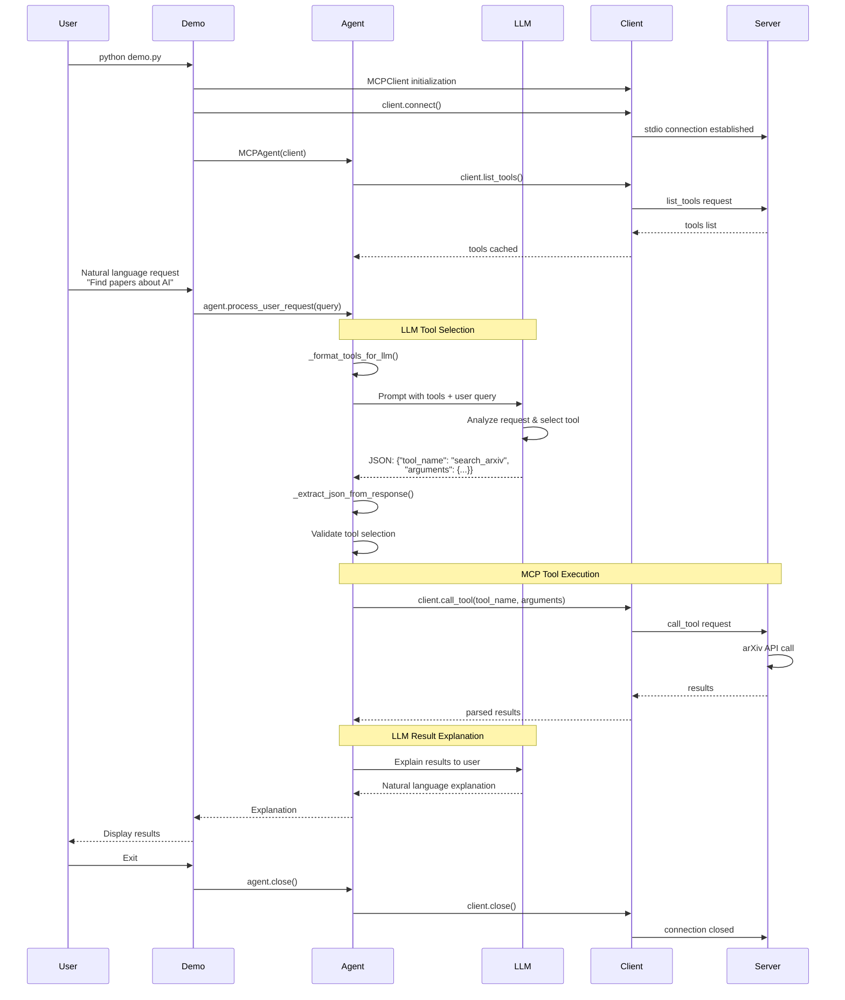
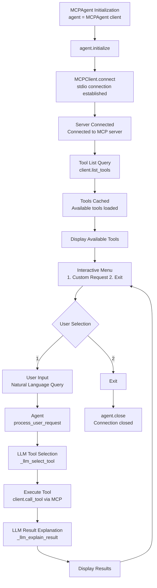

# arXiv MCP Agent

[](https://modelcontextprotocol.io)
[](https://www.python.org/downloads/)

A complete Model Context Protocol (MCP) implementation featuring both a client and server for interacting with the arXiv API. This project demonstrates all three MCP client primitives (Roots, Sampling, Elicitation) and provides a fully functional arXiv search and download service.

**One of the core strengths of MCP is its reusable server ecosystem** - this project uses the arXiv MCP server from [blazickjp/arxiv-mcp-server](https://github.com/blazickjp/arxiv-mcp-server), demonstrating how MCP clients can seamlessly integrate with existing servers in the ecosystem.

## Features

### MCP Client Primitives
- **Roots**: Filesystem boundaries that define server access permissions
- **Sampling**: LLM output requests using AWS Bedrock
- **Elicitation**: User input requests for interactive operations

### arXiv Server Tools
- **search_arxiv**: Search arXiv database with flexible query options
- **get_details**: Retrieve comprehensive metadata about articles
- **get_article_url**: Get direct URLs to articles
- **download_article**: Download PDF files to local storage
- **load_article_to_context**: Extract text content from PDFs for LLM context

## Project Structure

```
arxiv-mcp-agent/
├── src/
│   ├── client/               # MCP Client implementation
│   │   ├── __init__.py
│   │   ├── client.py         # MCPClient with all 3 primitives
│   │   └── agent.py          # High-level agent wrapper
│   └── server/               # MCP Server implementation
│       ├── src/
│       │   └── arxiv_server/
│       │       └── server.py # FastMCP server with arXiv tools
│       ├── pyproject.toml
│       └── README.md
├── examples/
│   └── demo.py               # Interactive demo script
├── downloads/                # PDF download directory
├── tests/                    # Test files
├── requirements.txt          
└── README.md                 
```

## Internal Architecture Flow


## Installation

### Prerequisites
- Python 3.10+
- AWS Account with Bedrock access (for Sampling primitive)
- Virtual environment (recommended)

### Setup

1. Clone the repository:
```bash
git clone https://github.com/backnumber19/arxiv-mcp-agent.git
cd arxiv-mcp-agent
```

2. Create and activate virtual environment:
```bash
python -m venv venv
source venv/bin/activate
```

3. Install dependencies:
```bash
pip install -r requirements.txt
```

4. Create `.env` file:
```bash
AWS_REGION=us-west-2
BEDROCK_MODEL=anthropic.claude-3-haiku-20240307-v1:0
ARXIV_SERVER_PATH=/absolute/path/to/src/server/src/arxiv_server
DOWNLOAD_PATH=/absolute/path/to/downloads
SSL_VERIFY=false
```

## Usage

### Running the Demo

The demo script showcases all three MCP client primitives and provides an interactive interface for arXiv operations:

```bash
python examples/demo.py
```

The demo includes:
1. **Roots Demo**: Demonstrates filesystem boundary configuration
2. **Sampling Demo**: Tests LLM integration with Bedrock
3. **Interactive Menu**: Search, download, and explore arXiv articles

### Using the Client Programmatically

```python
import asyncio
from src.client.agent import MCPAgent
from src.client.client import MCPClient

async def main():
    # Initialize client
    client = MCPClient(
        server_command="python",
        server_args=["/path/to/server.py"],
        server_env={"DOWNLOAD_PATH": "/path/to/downloads"},
        roots=[
            {"uri": "file:///current/dir", "name": "Current Directory"},
            {"uri": "file:///downloads", "name": "Downloads"}
        ]
    )
    
    agent = MCPAgent(client)
    await agent.initialize()
    
    # LLM automatically selects tools
    result1 = await agent.process_user_request("Find papers about machine learning")
    result2 = await agent.process_user_request("Download the paper: Attention Is All You Need")
    result3 = await agent.process_user_request("Get details for transformer architecture")
    
    await agent.close()

asyncio.run(main())
```

## Architecture

### MCPClient (`src/client/client.py`)
Core client implementation with:
- `_list_roots_callback()`: Returns configured filesystem roots
- `_sampling_callback()`: Handles LLM requests via Bedrock
- `connect()`: Establishes stdio connection to server
- `call_tool()`: Invokes server tools
- `list_tools()`: Enumerates available server tools

### MCPAgent (`src/client/agent.py`)
LLM-powered agent providing:
- `process_user_request()`: Main entry point for natural language requests
- `_llm_select_tool()`: LLM-based automatic tool selection
- `_llm_explain_result()`: LLM-based result explanation
- `_format_tools_for_llm()`: Formats available tools for LLM understanding
- Tool caching and validation

### Server (`src/server/src/arxiv_server/server.py`)

The arXiv server implementation is based on [blazickjp/arxiv-mcp-server](https://github.com/blazickjp/arxiv-mcp-server/tree/main/src/arxiv_mcp_server). This exemplifies MCP's core philosophy: **clients can leverage any MCP-compatible server from the ecosystem**, enabling rapid development and interoperability.

The server is a FastMCP-based implementation providing:
- arXiv API integration via httpx
- PDF processing with PyMuPDF
- Fuzzy title matching for article lookup
- Error handling and validation

**Note**: The server code in `src/server/` is cloned from the upstream repository. This demonstrates how MCP clients can integrate with existing servers without modification, showcasing the protocol's composability and ecosystem approach.


## Configuration

### Environment Variables

| Variable | Description | Default |
|----------|-------------|---------|
| `AWS_REGION` | AWS region for Bedrock | `us-west-2` |
| `BEDROCK_MODEL` | Bedrock model ID | `anthropic.claude-3-haiku-20240307-v1:0` |
| `ARXIV_SERVER_PATH` | Path to server directory | Required |
| `DOWNLOAD_PATH` | PDF download directory | `./downloads` |
| `SSL_VERIFY` | Enable SSL verification | `false` |

### Roots Configuration

Roots define filesystem boundaries for security:

```python
ROOTS = [
    {
        "uri": "file:///absolute/path/to/allowed/dir",
        "name": "Human-readable name"
    }
]
```

## Dependencies

### Core
- `mcp==1.20.0` - Model Context Protocol SDK
- `fastmcp==2.13.0.2` - FastMCP server framework
- `pydantic==2.12.3` - Data validation

### AWS Integration
- `boto3==1.35.91` - AWS SDK
- `langchain-aws==0.2.9` - LangChain AWS integration

### arXiv Integration
- `httpx==0.28.1` - Async HTTP client
- `feedparser` - RSS/Atom feed parsing
- `PyMuPDF==1.26.5` - PDF text extraction

### Utilities
- `python-dotenv==1.0.0` - Environment variable management

## Development

### Running Tests
```bash
pytest tests/
```

### Project Structure Guidelines
- Client code: `src/client/`
- Server code: `src/server/src/arxiv_server/`
- Examples: `examples/`
- Tests: `tests/`

## Troubleshooting

### Common Issues

1. **"Server file does not exist"**
   - Set `ARXIV_SERVER_PATH` in `.env` to absolute path
   - Ensure path points to directory containing `server.py`

2. **Bedrock errors in Sampling**
   - Verify AWS credentials are configured
   - Check `AWS_REGION` and `BEDROCK_MODEL` in `.env`
   - Ensure Bedrock access is enabled in AWS account

3. **Download failures**
   - Verify `DOWNLOAD_PATH` exists and is writable
   - Check network connectivity to arXiv.org
   - Review SSL verification settings

4. **Connection errors**
   - Ensure server Python path is correct
   - Verify all dependencies are installed
   - Check server logs for detailed error messages

5. **LLM tool selection errors**
   - Verify Bedrock is configured correctly
   - Check LLM response format (should be JSON)
   - Review tool descriptions for clarity

## Example Output

### Demo Session


## References

- [Model Context Protocol](https://modelcontextprotocol.io)
- [arXiv API Documentation](https://arxiv.org/help/api)
- [MCP Python SDK](https://github.com/modelcontextprotocol/python-sdk)
- [arXiv MCP Server (blazickjp)](https://github.com/blazickjp/arxiv-mcp-server) - Server implementation used in this project